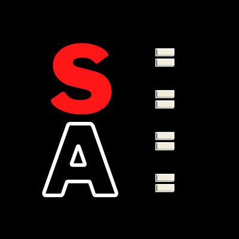
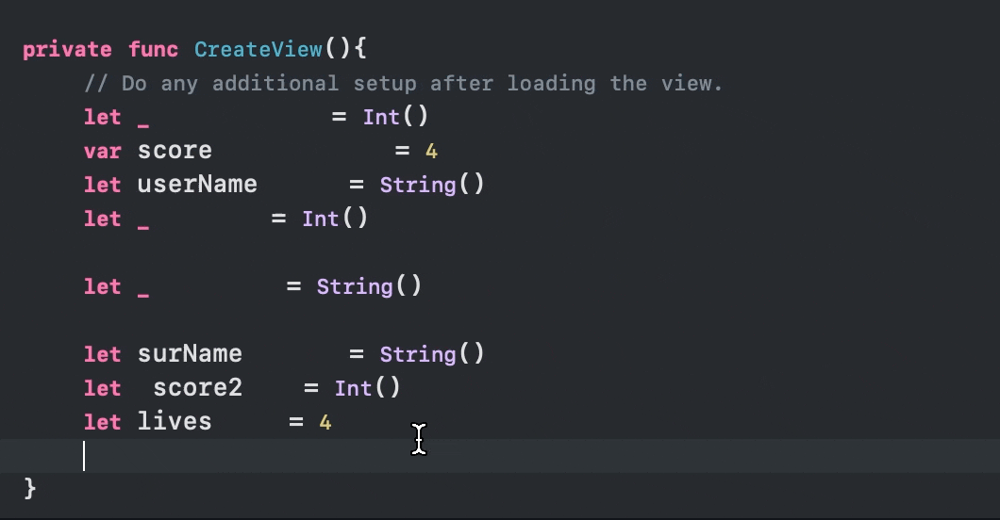
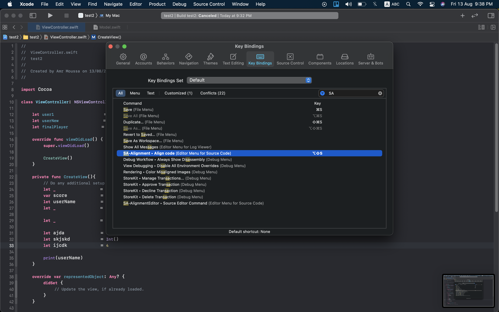

    

# SA-Alignment

**SA-Alignment** is an Xcode Source Editor extension that solves Sean Allen's problem of aligning lines accorfding to equal "=" sign .

## Examples

### Sort Imports

## Setting Hotkey in Xcode

- Open Xcode
- Go to Xcode > Preferences > Key Bindings
- Type *'SA-Alignment'* in search field
- Assign  <kbd>⇧</kbd> + <kbd>⎇</kbd> + <kbd>s</kbd> to *Align* command

## Feedback

Pull requests, issues and suggestions are warmly welcome.

Feel free to contact me [@amrmoussa777 Email](amrmoussa2016@icloud.com).
